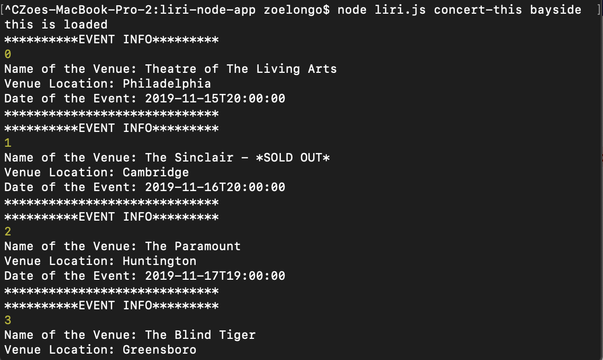
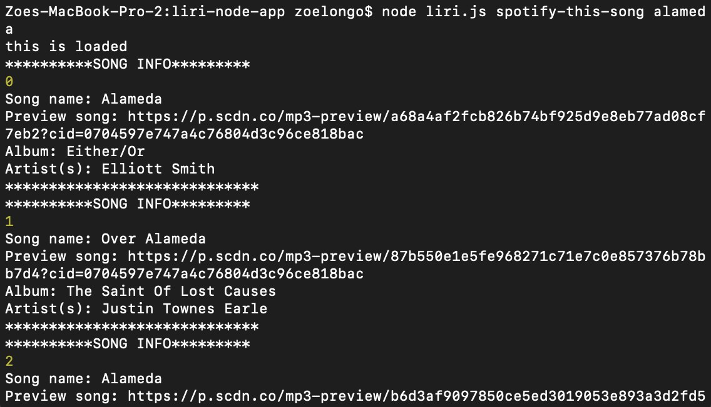
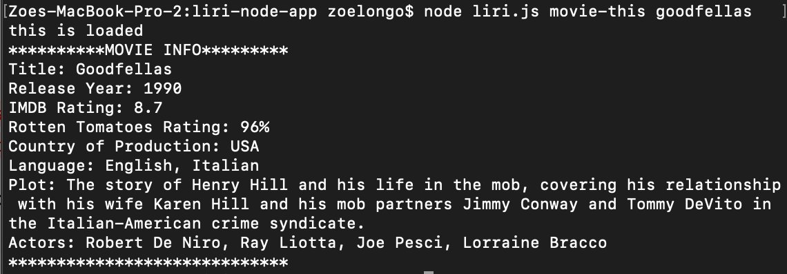
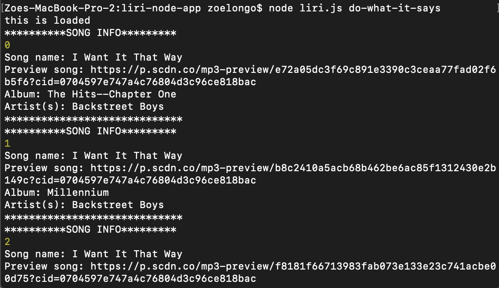

# liri-node-app

**Creator**: `Zoe Longo`

---

## About the App

LIRI, standing for Language Interpretation and Recognition Interface, is a command line node application that takes in parameters and returns data. The user has a choice of four different commands, and then can specify the search parameters. The four commands are:

1. `concert-this`

`concert-this` takes in a band and returns upcoming concerts using the bandsintown API.

2. `spotify-this-song`

`spotify-this-song` takes in a song and returns relative data via the Spotify API.

3. `movie-this`

`movie-this` takes in a movie and returns relative data via the OMDB API.

4. `do-what-it-says`

`do-what-it-says` reads a command off of the file random.txt and executes that command.

---

## How to use LIRI

**Instructions**

1. Open your terminal.
2. Navigate to where your liri.js file is located.
3. Run your desired command. Below is each command demonstrated.

    **Command 1 - `concert-this`**

    In your command line, run the following code: 

    `node liri.js concert-this <name of artist or band>`

    

    **Command 2 - `spotify-this-song`**

    In your command line, run the following code: 

    `node liri.js spotify-this-song <name of song>`

    

    **Command 3 - `movie-this`**

    In your command line, run the following code:

    `node liri.js movie-this <name of movie>`

    

    **Command 4 - `do-what-it-says`**

    With this command, it is reading another command off of the file random.txt. Change the file contents according to what command you would wish to execute. Then in your command line, run the following code:

    `node liri.js do-what-it-says`

    

---

## TECHNOLOGIES USED
* Javascript
* Nodejs
* Node packages:
    * Node-Spotify-API
    * Request
    * Moment
    * DotEnv
* APIs used:
    * Bands in Town
    * OMDB
* Git
* GitHub

